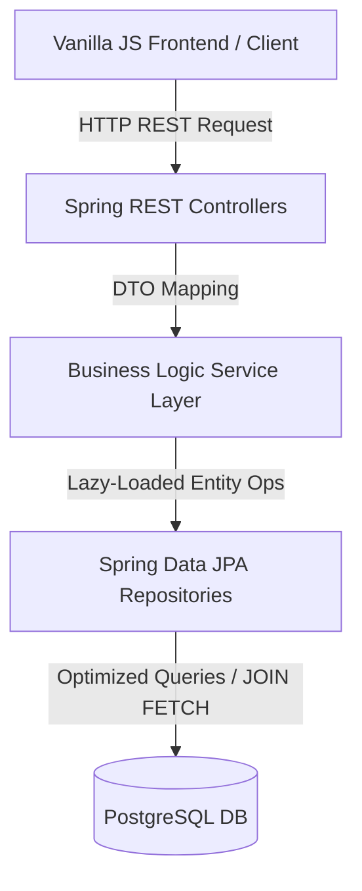

# 📊 SurveyApp — Enterprise Survey & Participant Management System

[](https://www.oracle.com/java/)
[](https://spring.io/projects/spring-boot)
[](https://spring.io/projects/spring-security)
[](https://www.postgresql.org/)
[](https://hibernate.org/)
[](https://maven.apache.org/)

SurveyApp is a secure, highly optimized, and robust enterprise-grade survey management platform. It allows users to build dynamic questionnaires, distribute secure tokenized participation links, track respondents, and visualize answers in real-time. 

Designed with modern architectural patterns, it solves major common pitfalls in ORM applications, such as N+1 query problems and recursive object serialization loops.

---

## 💡 Core Architecture & Technical Accomplishments

### 🚀 1. Database & Query Performance Tuning (N+1 Query Storm Resolution)
*   **The Problem:** Default JPA configurations eagerly load `@ManyToOne` relationships and lazy-load collections inside REST controllers. Jackson's JSON serialization triggered nested database queries, resulting in $N+1$ or even $O(N \times M)$ query storms (dozens of SQL statements for a single page load).
*   **The Solution:**
    *   Switched all `@ManyToOne` and `@OneToOne` associations to explicit `FetchType.LAZY` across entities (`Answer`, `Question`, `Survey`, `SurveyInvitation`).
    *   Implemented **JPQL Fetch Joins** (`JOIN FETCH`) in the repository layer to load parent entities and their associated collections in a single, atomic SQL `LEFT JOIN` statement.
    *   Reduced dashboard loading database calls **from over 20+ queries to exactly 1 query** ($O(1)$ complexity).

```java
// SurveyRepository.java - High Performance Fetch Join Query
@Query("SELECT DISTINCT s FROM Survey s LEFT JOIN FETCH s.questions WHERE s.user = :user")
List<Survey> findByUserWithQuestions(@Param("user") User user);
```

### 🛡️ 2. Presentation Layer Decoupling (DTO Pattern & ModelMapper)
*   Prevented database model leakage by implementing the **Data Transfer Object (DTO)** pattern.
*   Decoupled internal schema structures (Entities) from client-facing REST APIs using **ModelMapper**.
*   Eliminated recursive JSON serialization loops and `LazyInitializationException` errors during JSON rendering.

### 🔑 3. Role-Based Access Control (RBAC) & Spring Security
*   Implemented stateful/session-based secure authentication utilizing Spring Security's filter chain.
*   Enforced strict context authorization checks: Survey creators are restricted to modifying or viewing results only for resource objects (`Surveys`, `Questions`, `Invitations`) which they own.

### 📧 4. Asynchronous Notification & Tokenized Invite Pipeline
*   Integrated a secure participant workflow using cryptographically secure UUID tokens.
*   Automated invitation emails with dynamically generated secure response URLs via **Spring Boot Mail Starter** over SMTP.

---

## 📂 System Architecture Flow

The system uses a strict 3-tier layered architecture to isolate concerns:



---

## 🛠️ Technology Stack

| Layer | Technologies & Libraries Used |
| :--- | :--- |
| **Backend Core** | Java 17, Spring Boot 3.2.5, Spring Data JPA |
| **Security & Auth** | Spring Security 6.2 |
| **Database** | PostgreSQL / NeonDB, Hibernate 6.4.4.Final |
| **Mapping & Utility** | ModelMapper 3.2.0, Lombok, Jakarta Persistence API |
| **Mail & Messaging** | Spring Boot Starter Mail (SMTP Integration) |
| **Frontend** | HTML5, CSS3 (Modern Flexbox/Grid UI), Vanilla JavaScript (ES6+ Fetch API) |

---

## ⚙️ Local Development & Setup

### Prerequisites
*   **JDK 17** installed (Adoptium OpenJDK recommended)
*   **Maven 3.8+**
*   **PostgreSQL** instance running locally or on a cloud provider

### 1. Clone the Project
```bash
git clone https://github.com/Hakkitaygun/survey-application.git
cd survey-application/survey-app
```

### 2. Database & SMTP Configuration
Configure your credentials in `src/main/resources/application.properties`:
```properties
# Database Connectivity
spring.datasource.url=jdbc:postgresql://localhost:5432/survey_db
spring.datasource.username=your_postgres_user
spring.datasource.password=your_postgres_password
spring.jpa.hibernate.ddl-auto=update
spring.jpa.show-sql=true
spring.jpa.properties.hibernate.format_sql=true

# SMTP Mail Server Settings
spring.mail.host=smtp.gmail.com
spring.mail.port=587
spring.mail.username=your_business_email@gmail.com
spring.mail.password=your_app_specific_password
spring.mail.properties.mail.smtp.auth=true
spring.mail.properties.mail.smtp.starttls.enable=true
```

### 3. Build and Start the Application
Compile the sources, run unit tests, and start the embedded Tomcat server:
```bash
# Clean and compile
./mvnw clean package

# Run the boot app
./mvnw spring-boot:run
```
The application will launch on `http://localhost:8080`.

---

## 📝 API Endpoint Documentation

### Auth Endpoint
*   `POST /api/auth/login` - Validates credentials and initializes authentication context.

### Survey Endpoints (`/api/v1/surveys`)
*   `GET /api/v1/surveys` - Fetches DTO-mapped surveys owned by the logged-in user. *(Optimized with Join Fetch)*
*   `POST /api/v1/surveys` - Creates a new survey entity.
*   `GET /api/v1/surveys/{surveyId}/results` - Returns participant response metrics and answer analytics.
*   `POST /api/v1/surveys/{surveyId}/invite` - Generates invite tokens and dispatches registration links via email.

### Question Endpoints
*   `GET /api/v1/surveys/{surveyId}/questions` - Returns questions list of a survey.
*   `POST /api/v1/surveys/{surveyId}/questions` - Appends a question to a survey.

### Participation Endpoints (`/api/v1/answers`)
*   `GET /api/v1/answers/solve?token={token}` - Retrieves survey questions anonymously using a valid invitation token.
*   `POST /api/v1/answers/submit` - Submits the answers collection.
